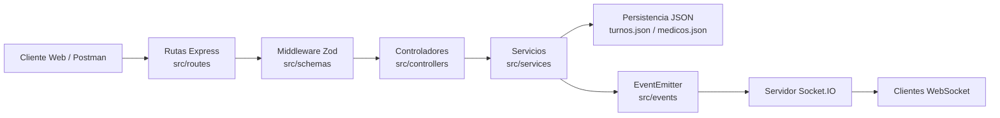
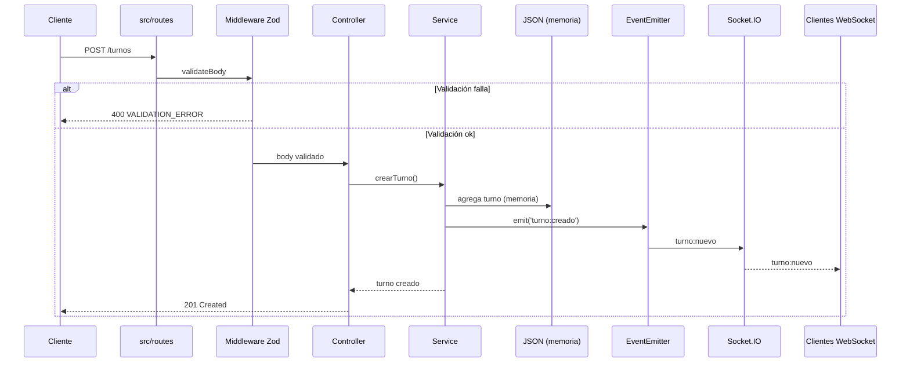

# TurnosRed

Backend para la gestión de turnos médicos (**Actividades 1 y 2 de Integraciones web**). Usa Node.js, TypeScript, Express, Zod, EventEmitter y Socket.IO.

## Requisitos previos

- Node.js 22 LTS (vía NVM)
- npm
- Postman (para pruebas)

## Instalación

```bash
nvm use
npm install
cp .env.example .env
npm run dev
```

Servidor: `http://localhost:3000`
Cliente de eventos: `http://localhost:3000/socket-test.html`

## Variables de entorno

| Variable    | Descripción            | Ejemplo              |
| ----------- | ---------------------- | -------------------- |
| `PORT`      | Puerto HTTP            | `3000`               |
| `DATA_FILE` | Ruta al JSON de turnos | `./data/turnos.json` |

## Scripts npm

| Script               | Uso                          |
| -------------------- | ---------------------------- |
| `npm run dev`        | Servidor en modo desarrollo  |
| `npm start`          | Ejecuta el servidor          |
| `npm run build`      | Compila TypeScript a `dist/` |
| `npm run start:prod` | Ejecuta el código compilado  |
| `npm run lint`       | Revisa el código con ESLint  |
| `npm run format`     | Aplica Prettier              |

## Estructura de directorios

```text
src/
├── controllers/   # Respuestas HTTP
├── events/        # EventEmitter interno
├── models/        # Interfaces Turno, Medico y crudas
├── routes/        # Rutas Express
├── schemas/       # Esquemas Zod y middleware de validación
├── services/      # Lectura JSON y CRUD
├── utils/         # Normalización y errores
└── server.ts      # Express + HTTP + Socket.IO

data/              # turnos.json, medicos.json
public/            # socket-test.html
```

## Endpoints

### Turnos

| Método | Ruta          | Acción           | Códigos típicos |
| ------ | ------------- | ---------------- | --------------- |
| GET    | `/turnos`     | Listar turnos    | 200, 400        |
| GET    | `/turnos/:id` | Obtener por ID   | 200, 400, 404   |
| POST   | `/turnos`     | Crear turno      | 201, 400        |
| PUT    | `/turnos/:id` | Actualizar turno | 200, 400, 404   |
| DELETE | `/turnos/:id` | Eliminar turno   | 204, 400, 404   |

Filtros (query params) de `GET /turnos`:

```text
/turnos?especialidad=Pediatria&fecha=14/08/2026&medicoId=2
```

### Médicos

| Método | Ruta           | Acción             | Códigos típicos |
| ------ | -------------- | ------------------ | --------------- |
| GET    | `/medicos`     | Listar médicos     | 200             |
| GET    | `/medicos/:id` | Obtener por ID     | 200, 400, 404   |
| POST   | `/medicos`     | Registrar médico   | 201, 400        |
| PUT    | `/medicos/:id` | Actualizar médico  | 200, 400, 404   |
| DELETE | `/medicos/:id` | Dar de baja médico | 204, 400, 404   |

Filtros (query params) de `GET /medicos`:

```text
/medicos?especialidad=Odontologia&disponible=true
```

## Formato estándar de errores

Todas las respuestas de error usan la misma estructura:

```json
{
  "status": 400,
  "message": "Error de validación en los datos ingresados",
  "code": "VALIDATION_ERROR",
  "details": [{ "field": "especialidad", "message": "..." }]
}
```

| Código             | Significado                    |
| ------------------ | ------------------------------ |
| `VALIDATION_ERROR` | Fallo de esquema Zod           |
| `INVALID_ID`       | ID no entero positivo          |
| `NOT_FOUND`        | Recurso inexistente            |
| `BAD_REQUEST`      | Datos inválidos o incompletos  |
| `INTERNAL_ERROR`   | Error no controlado del server |

## Validaciones con Zod

- `documento` se acepta como string o número y se convierte a string.
- `especialidad` debe usar formato Title Case (ej. `Clínica médica`, `Pediatría`, `Odontología`, `Nutrición`).
- `fecha` en formato `DD/MM/YYYY` y `hora` en `HH:MM` o `HH.MM`.
- `confirmado`/`disponible` admiten boolean, número o texto (`si`, `no`, `true`, `1`, `0`...).
- Los errores de Zod devuelven 400 con `details` indicando el campo exacto que falló.

## Normalización

Al iniciar, el servidor lee `data/turnos.json` y `data/medicos.json` de forma asíncrona. Los registros se convierten al modelo de dominio: `id` a entero positivo, `documento` a string, espacios saneados, fecha a `YYYY-MM-DD`, hora con `:` y booleanos normalizados. Los inválidos se descartan e informa aceptados/rechazados por consola.

## Eventos y tiempo real

Eventos internos (EventEmitter): `turno:creado`, `turno:actualizado`, `turno:eliminado`.
Socket.IO (a los clientes): `turno:nuevo`, `turno:actualizado`, `turno:eliminado`.
Abrir `http://localhost:3000/socket-test.html` para verlos sin recargar.

## Pruebas con Postman

- Colección: `.docs/turnos-red.postman_collection.json` (importarla en Postman).
- Variables: `baseUrl`, `token`, `turnoId`, `medicoId` (los tres últimos se actualizan solos al login o al crear).
- Cada request incluye tests automáticos (status code y esquema JSON).
- Hay casos de éxito, 400 por validación Zod y 404 — servirán también como Saved Responses del Mock Server.

## Diagramas de arquitectura (Mermaid)





## Autenticación (JWT)

- Registro: `POST /auth/registro` con `{ "nombre", "password", "rol"? }` → 201. La contraseña se guarda hasheada con bcryptjs.
- Login: `POST /auth/login` con `{ "nombre", "password" }` → 200 y un `token` JWT (válido 2 h, firmado con `JWT_SECRET`, payload con `id` y `rol`).
- Usar el token: header `Authorization: Bearer <token>` en las operaciones de escritura (POST/PUT/DELETE) de `/turnos` y `/medicos`. Los GET son públicos.
- Respuestas 401: `AUTH_TOKEN_MISSING` si falta el header o `AUTH_TOKEN_INVALID` si el token es inválido/expiró.

Flujo resumido:

```bash
curl -X POST http://localhost:3000/auth/registro -H 'Content-Type: application/json' -d '{"nombre":"admin","password":"secreto123","rol":"admin"}'
curl -X POST http://localhost:3000/auth/login -H 'Content-Type: application/json' -d '{"nombre":"admin","password":"secreto123"}'
curl -X POST http://localhost:3000/turnos -H "Authorization: Bearer <token>" -H 'Content-Type: application/json' -d '{...}'
```

## Pruebas automatizadas

```bash
npm test
```

Suite con Jest + ts-jest + Supertest en tres capas: unitarias en `tests/unit` (capa de servicios con mocks de `node:fs/promises`), integración en `tests/integration` (Supertest contra la app Express) y E2E en `tests/e2e` (registro → login → crear → leer → actualizar → eliminar). El reporte de cobertura se genera con `--coverage`; la cobertura actual supera el 80 % en `src/services`.

## Despliegue (Nginx)

1. Configurar `.env` de producción: `NODE_ENV=production`, `LOG_LEVEL=error`, `JWT_SECRET` robusto, `PORT=3000`.
2. Levantar la API: `npm run start:prod` (o vía PM2/systemd).
3. Validar la configuración y arrancar Nginx:

```bash
nginx -t
docker run --rm -p 80:80 -v $(pwd)/nginx.conf:/etc/nginx/nginx.conf:ro nginx
```

Recomendaciones de seguridad: no publicar `JWT_SECRET` ni `.env`, rotar JWT_SECRET
de forma consciente (invalida tokens vigentes), añadir TLS delante de Nginx en
producción y mantener los logs de Pino sin contraseñas ni tokens.

## Uso de Inteligencia Artificial

| Tarea              | Herramienta | Prompt                                                       | Respuesta generada                               | Ajuste manual aplicado                               |
| ------------------ | ----------- | ------------------------------------------------------------ | ------------------------------------------------ | ---------------------------------------------------- |
| Formato de error   | Claude      | "Unifica respuestas de error"                                | Helper de error estándar                         | Revisado y probado contra los endpoints              |
| Actualizar README  | Claude      | "Actualiza el README con lo nuevo de la Act. 2"              | Reescritura de secciones                         | Corrección de tablas y formato final                 |
| Diagramas Mermaid  | Claude      | "Componentes y secuencia de POST /turnos"                    | Sintaxis Mermaid                                 | Corrección del flujo de validación y eventos         |
| Plantillas ADR     | Claude      | "ADR-001 OpenAPI y ADR-002 JWT"                              | Secciones obligatorias                           | Ajuste de fechas, estado y contexto                  |
| JWT y bcryptjs     | Claude      | "Agrega authService con JWT y bcryptjs"                      | Rutas /auth/registro y /auth/login               | Ajuste de persistencia en data/usuarios.json         |
| Middleware errores | Claude      | "Middleware central de errores con firma (err,req,res,next)" | app.ts con códigos de dominio                    | Ajuste de JSON inválido (SyntaxError) y _next        |
| Morgan + Pino      | Claude      | "Configura Morgan y Pino con nivel por entorno"              | src/config/logger.ts                             | Hash de contraseñas fuera de logs y mensajes limpios |
| nginx.conf         | Claude      | "Nginx proxy inverso hacia localhost:3000"                   | Configuración con Host/X-Real-IP/X-Forwarded-For | Cabeceras adicionales según consigna                 |
